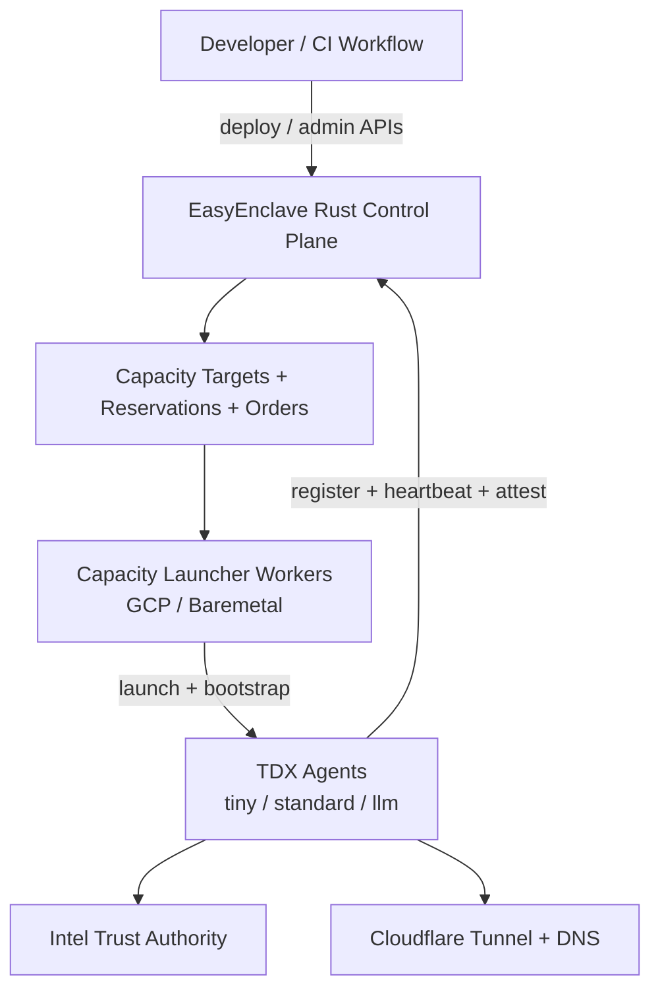
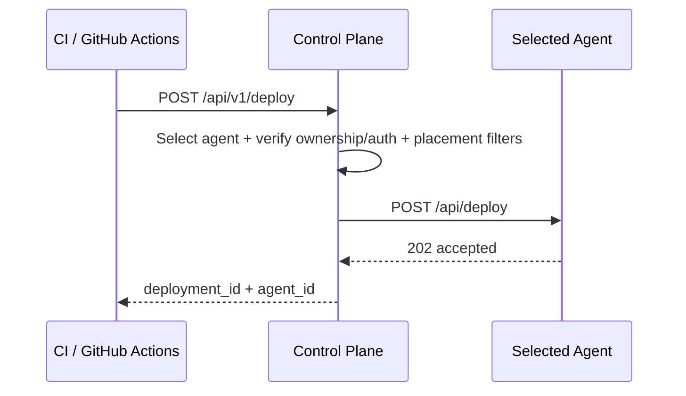

# EasyEnclave Architecture

This document describes the current Rust-first EasyEnclave architecture.

## 1) System Overview

## 2) Deploy Path (Control Plane Owned)

## 3) Responsibilities

- Control Plane
  - Agent lifecycle and attestation checks
  - Deployment preflight and placement
  - Capacity target/reservation/order orchestration
  - Admin auth (password + GitHub OAuth) and owner auth (API key + GitHub OIDC)
- Capacity Workers
  - Claim launch orders from CP
  - Boot provider-specific capacity (GCP/baremetal)
  - Bootstrap agents so they register back to CP
- Agents
  - TDX attestation and health reporting
  - Deployment execution and service runtime
  - Optional Cloudflare tunnel registration

## 4) Canonical Workflow References

- `.github/workflows/test.yml`
- `.github/workflows/pr-staging-checks.yml`
- `.github/workflows/staging-rollout.yml`
- `.github/workflows/release-trust-bundle.yml`
- `.github/workflows/release-gcp-image.yml`
- `.github/workflows/production-rollout.yml`
- `.github/workflows/bootstrap-control-plane.yml`

## 5) Related Docs

- `docs/CAPACITY_LAUNCHER.md`
- `docs/CI_CD_NETWORKS.md`
- `docs/runbooks/release-production.md`
