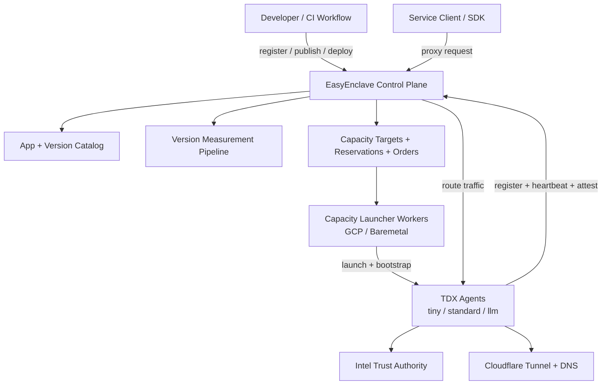
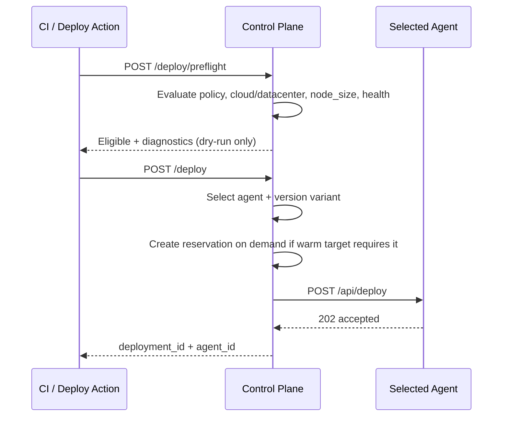
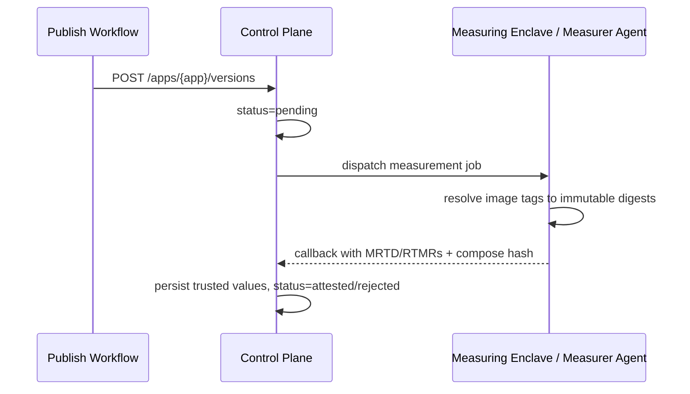

# EasyEnclave Architecture

This document describes the current EasyEnclave architecture after the control-plane cutover:
- Placement and deploy decisions are made in the control plane.
- Warm-capacity reservations are managed in the control plane.
- Agent launchers/workers provide capacity but do not make placement decisions.

## 1) System Overview

## 2) Deploy Path (Control Plane Owned)

## 3) Measurement Path

## 4) Responsibilities

- Control Plane
  - App/version registry
  - Deploy preflight and placement
  - Warm-pool target management and reservation lifecycle
  - Measurement orchestration and trust policy
- Capacity Workers
  - Claim launch orders from CP
  - Boot provider-specific capacity (GCP/baremetal)
  - Bootstrap agents so they register back to CP
- Agents
  - TDX attestation and health reporting
  - Deployment execution and service runtime
  - Optional Cloudflare tunnel registration

## 5) Key Flows and References

- Deploy example workflows:
  - `.github/workflows/deploy-examples.yml`
  - `.github/workflows/deploy-examples-gcp.yml`
- Deploy action internals:
  - `.github/actions/deploy/action.yml`
  - `scripts/deploy_action.sh`
- Capacity launcher docs:
  - `docs/CAPACITY_LAUNCHER.md`
