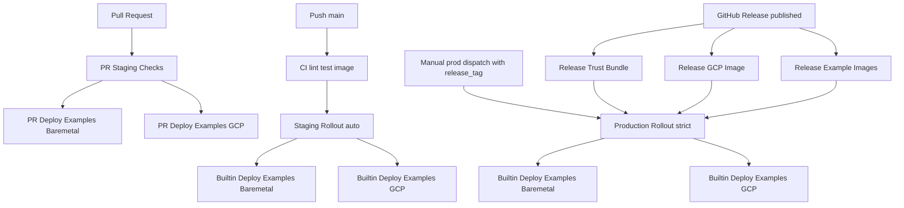

# CI/CD Networks: Staging and Production

This document defines the canonical CI/CD split for EasyEnclave networks.

## Goals

- Run per-PR staging deploy validation for same-repo PRs.
- Keep staging rollout automatic from latest `main` with no billing spend.
- Require production rollout to target an explicit release tag with pinned trust bundle values.
- Run builtin deploy examples for baremetal and GCP in parallel.

## Workflow Graph

## Environment Profiles

### Staging

- Trigger: `Staging Rollout` after `CI` success on `main` (or manual).
- Trust level: **untrusted** (test-only network).
- Auth policy: relaxed for iteration (`AUTH_REQUIRE_GITHUB_OAUTH_IN_PRODUCTION=false`).
- Attestation policy: nonce optional, warn on RTMR/signature drift.
- Billing policy: disabled (`BILLING_ENABLED=false`) and simulated requests.
- Objective: validate the newest `main` features first, with low-cost integration confidence and cheaper access to stronger CPU/GPU capacity for testing. Do not treat staging as a trusted production boundary. Same-repo PR checks also run builtin deploy examples against staging.

### Production

- Trigger: `Production Rollout` via manual dispatch with `release_tag`.
- Release prerequisites:
  - `Release Trust Bundle` must publish `trusted_values.<tag>.json` (or `trusted_values.json`) on that release.
  - `Release GCP Image` must publish `gcp-image.<tag>.json` (or `gcp-image.json`) on that release.
- `Release Example Images` must publish `example-images.<tag>.json` (or `example-images.json`) because production always dispatches builtin examples after bootstrap.
- Auth policy: strict (`AUTH_REQUIRE_GITHUB_OAUTH_IN_PRODUCTION=true`).
- Attestation policy: strict TCB + nonce + RTMR + signature verification with trust values pinned to the selected release tag.
- Provisioning policy: CP-native GCP provisioning uses the exact release-pinned image descriptor (project + image name).
- Billing policy: enabled (`BILLING_ENABLED=true`, no simulation).
- Objective: deterministic release with full attestation posture.

## Canonical Workflows

- `.github/workflows/test.yml`
- `.github/workflows/pr-staging-checks.yml`
- `.github/workflows/staging-rollout.yml`
- `.github/workflows/release-trust-bundle.yml`
- `.github/workflows/release-gcp-image.yml`
- `.github/workflows/release-example-images.yml`
- `.github/workflows/production-rollout.yml`

Reusable/manual components:

- `.github/workflows/bootstrap-control-plane.yml`
- `.github/workflows/deploy-examples.yml`
- `.github/workflows/deploy-examples-gcp.yml`

## Policy Notes

- `deploy-examples*.yml` are intentionally reusable/manual only.
- Staging rollout mutates staging automatically; production mutation is release-gated and manual.
- PR checks can run deploy examples only for same-repo PRs on the staging control plane.
- Baremetal and GCP example deploys execute in parallel after bootstrap.
- In production, those example deploys are dispatched asynchronously so production cutover is not blocked by long-tail example execution time.
