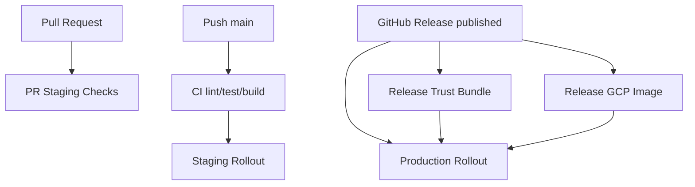

# CI/CD Networks: Staging and Production

This document defines the canonical staging/production rollout model.

## Goals

- Keep staging rollouts automatic from latest `main`.
- Keep production rollouts release-gated and deterministic.
- Require release-pinned trust bundle and GCP image assets for production.

## Workflow Graph

## Environment Profiles

### Staging

- Trigger: `Staging Rollout` on `main` pushes (or manual dispatch).
- CI gate: rollout waits for `CI` success on the target SHA.
- Billing policy: disabled/simulated.
- Purpose: integration confidence on latest `main` with low risk.

### Production

- Trigger: `Production Rollout` on published release, or manual dispatch with `release_tag`.
- Release prerequisites:
  - `Release Trust Bundle` publishes `trusted_values.<tag>.json` or `trusted_values.json`.
  - `Release GCP Image` publishes `gcp-image.<tag>.json` or `gcp-image.json`.
- Attestation policy: strict and release-pinned.
- Billing policy: enabled.
- Purpose: deterministic release deployment.

## Canonical Workflows

- `.github/workflows/test.yml`
- `.github/workflows/pr-staging-checks.yml`
- `.github/workflows/staging-rollout.yml`
- `.github/workflows/release-trust-bundle.yml`
- `.github/workflows/release-gcp-image.yml`
- `.github/workflows/production-rollout.yml`
- `.github/workflows/bootstrap-control-plane.yml`

## Policy Notes

- Production rollout must not trigger on push/pull_request.
- Staging and production URLs must be distinct.
- Production always pins trust/materials to the selected release tag.
